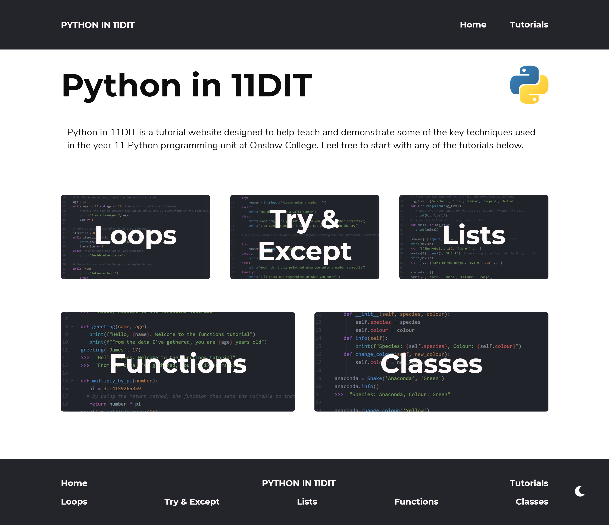
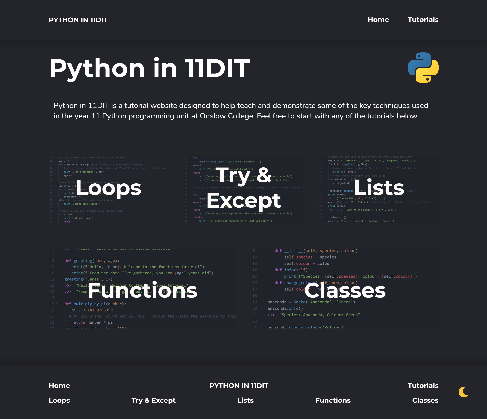
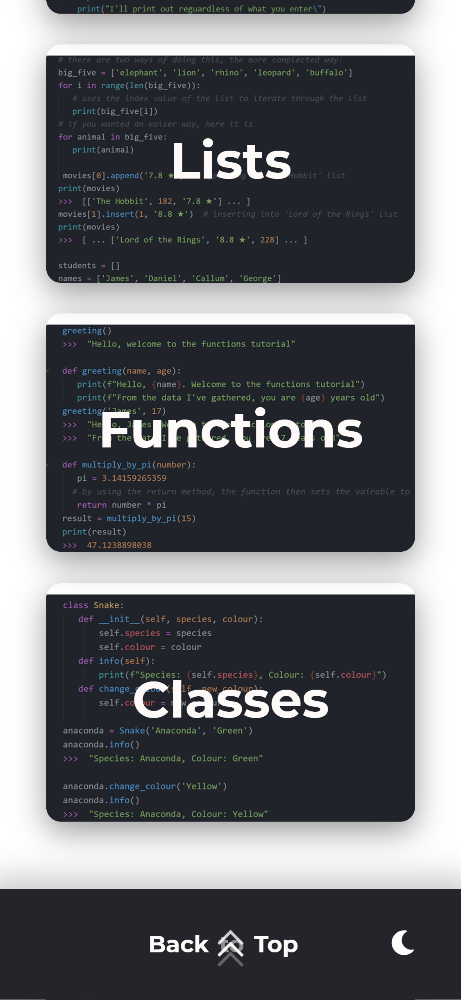
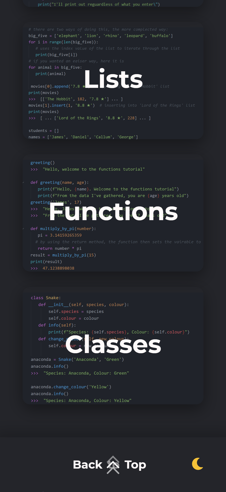
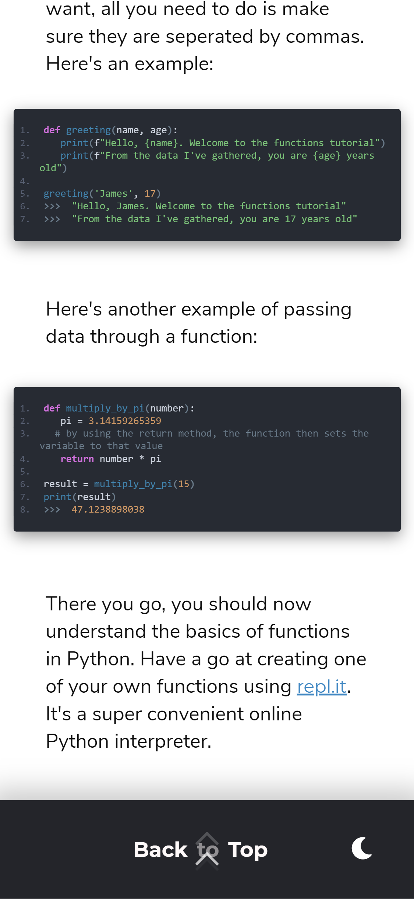
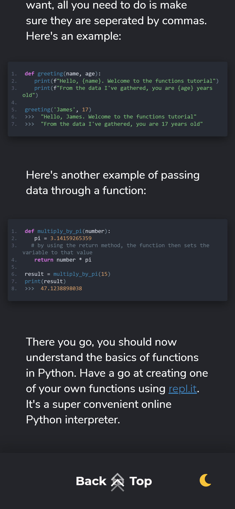

<!-- PROJECT SHIELDS -->
<!--
*** I'm using markdown "reference style" links for readability.
*** Reference links are enclosed in brackets [ ] instead of parentheses ( ).
*** See the bottom of this document for the declaration of the reference variables
*** for contributors-url, forks-url, etc. This is an optional, concise syntax you may use.
*** https://www.markdownguide.org/basic-syntax/#reference-style-links
-->
[![Contributors][contributors-shield]][contributors-url]
[![Forks][forks-shield]][forks-url]
[![Stargazers][stars-shield]][stars-url]
[![Issues][issues-shield]][issues-url]
[![MIT License][license-shield]][license-url]


<!-- PROJECT LOGO -->
<br />
<p align="center">
  <a href="https://github.com/JamisBuggerlugs/Python_Tutorial_Website">
    
  </a>

  <!-- <h3 align="center">PYTHON IN 11DIT</h3> -->

  <p align="center">
    Python in 11DIT is a tutorial website designed to help teach and demonstrate some of the key techniques used in the year 11 Python programming unit at Onslow College. Feel free to start with any of the tutorials below.
    <br />
    <a href="https://github.com/JamisBuggerlugs/Python_Tutorial_Website"><strong>Explore the docs »</strong></a>
    <br />
    <br />
    <a href="https://jamisbuggerlugs.github.io/Python_Tutorial_Website/">View Website</a>
    ·
    <a href="https://github.com/JamisBuggerlugs/Python_Tutorial_Website/issues">Report Bug</a>
    ·
    <a href="https://github.com/JamisBuggerlugs/Python_Tutorial_Website/issues">Request Feature</a>
  </p>
</p>

___


<!-- ABOUT THE PROJECT -->
## About The Project
I intend to develop a tutorial website that teaches students some of the advanced programming techniques used in the
11DIT course. The purpose of this site will be to convey digital tech concepts taught in the 11DIT course at Onslow College in an easy to
comprehend manor. The audience I will be targeting this website towards will be primarily Year 11 students studying 11DIT at Onslow
College, however anyone with the intent to learn those concepts demonstrated are welcome.

<!-- [![Product Name Screen Shot][product-screenshot]](https://jamisbuggerlugs.github.io/Python_Tutorial_Website/)  -->
#### Desktop Version
<a href="https://jamisbuggerlugs.github.io/Python_Tutorial_Website/">
   <p float="left" align="middle">
     
     
   </p>
</a>

#### Mobile Version (only available on Samsung Galaxy 10 & iPhone X)
<a href="https://jamisbuggerlugs.github.io/Python_Tutorial_Website/">
   <p float="left" align="middle">
     
     
     
     
   </p>
</a>


### Built With

* HTML
* CSS
* JavaScript


<!-- GETTING STARTED -->
## Getting Started

The a two ways to view the website, the first and most easiest is to view it on [GitHub Pages](https://jamisbuggerlugs.github.io/Python_Tutorial_Website/).
Or to get a local copy up and running follow these simple steps.

### Installation

1. Clone the repo using Git
```sh
git clone https://github.com/JamisBuggerlugs/Python_Tutorial_Website.git
```
2. Download the zip file from above


<!-- USAGE EXAMPLES -->
## Usage

Use this space to show useful examples of how a project can be used. Additional screenshots, code examples and demos work well in this space. You may also link to more resources.

<!-- ACKNOWLEDGEMENTS -->
## Acknowledgements

* [JQuery](https://jquery.com/)
* [EnlighterJS](https://github.com/EnlighterJS/EnlighterJS)
* [FontAwesome](https://fontawesome.com/)

___

<!-- CONTACT -->
## Contact

James Robiony-Rogers - james.robiony-rogers@student.onslow.school.nz

Project Link: [https://github.com/JamisBuggerlugs/Python_Tutorial_Website](https://github.com/JamisBuggerlugs/Python_Tutorial_Website)


<!-- MARKDOWN LINKS & IMAGES -->
<!-- https://www.markdownguide.org/basic-syntax/#reference-style-links -->
[contributors-shield]: https://img.shields.io/github/contributors/jamisbuggerlugs/Python_Tutorial_Website.svg?style=flat-square
[contributors-url]: https://github.com/JamisBuggerlugs/Python_Tutorial_Website/graphs/contributors
[forks-shield]: https://img.shields.io/github/forks/JamisBuggerlugs/Python_Tutorial_Website.svg?style=flat-square
[forks-url]: https://github.com/JamisBuggerlugs/Python_Tutorial_Website/network/members
[stars-shield]: https://img.shields.io/github/stars/JamisBuggerlugs/Python_Tutorial_Website.svg?style=flat-square
[stars-url]: https://github.com/JamisBuggerlugs/Python_Tutorial_Website/stargazers
[issues-shield]: https://img.shields.io/github/issues/JamisBuggerlugs/Python_Tutorial_Website.svg?style=flat-square
[issues-url]: https://github.com/JamisBuggerlugs/Python_Tutorial_Website/issues
[license-shield]: https://img.shields.io/github/license/JamisBuggerlugs/Python_Tutorial_Website.svg?style=flat-square
[license-url]: https://github.com/JamisBuggerlugs/Python_Tutorial_Website/blob/master/LICENSE.txt
[linkedin-shield]: https://img.shields.io/badge/-LinkedIn-black.svg?style=flat-square&logo=linkedin&colorB=555
[linkedin-url]: https://linkedin.com/in/JamisBuggerlugs
[product-screenshot]: imgs/readme-assets/desktop-home-light.png
